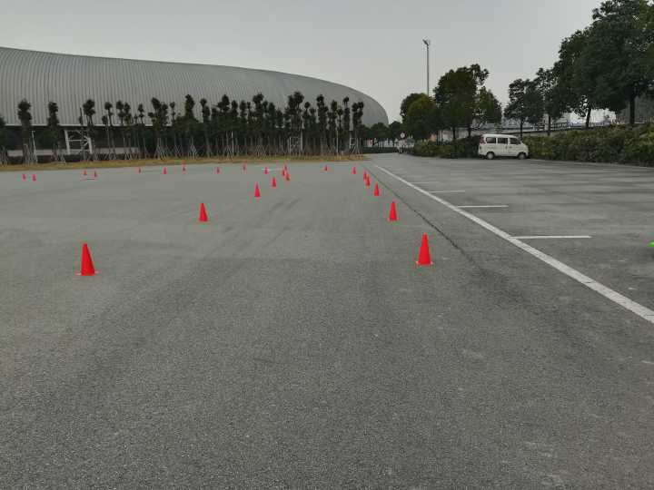

车队以后的方向肯定是无人车, 会在软件方面下许多功夫, 比如需要研发一个导航系统.虽然因为 性能问题这个系统里最要求算力的部分还是会用C++之类的写, 但python作为一门胶水语言还是很有 可能会用到的. 又比如我现在为显示屏做的这个交互系统用一个python框架做的. 另外我个人也很喜欢 python (因为写着简单), 总之学一下没坏处啦😁.

<!-- More -->

如果你不适应看教程文档想看网课, 我推荐 [计算机科学和Python编程导论（自主模式）](http://www.xuetangx.com/courses/course-v1:MITx+6_00_1x+sp/about).

# 部署开发环境

🌟 文章一些术语或者细节也许你看完这篇之后也完全弄不懂, 但别丧气, 用着用着你就能 懂了. 我一开始也是完全不懂.

部署, 指的就是布置, 开发环境指的是用来开发程序的各种零零碎碎的软件, 设置等等. 具体到此处就是说安装python, 安装python的包管理工具, 安装好用的代码编辑器, 安装本次任务 所需要的依赖库.

⚠ 我为了说明我们到底要做什么分开说明的, 但其实这是一套流程, 并不是分开的. 操作并不算太麻烦💪

## python代码工具的安装

### Anaconda

#### 基本信息

> Anaconda是一种Python语言的开源发行版，用于进行大规模数据处理、预测分析，和科学计算，致力于简化包的管理和部署. Anaconda使用软件包管理系统Conda进行包管理.(摘自维基)

比较难懂,看了也可能不知道什么意思. 对其中几个概念解释一下:

- `开源`是开放源文件的意思, 开源是计算机领域十分提倡的一个理念, 现在你只 需要知道开源的东西肯定是免费的.
- `发行版`即是指这是一个python大礼. 里面有 [一些对数据分析很有帮助的工具](https://leojhonsong.github.io/fury/python速成-python图像处理体验/#安装Python的OpenCV库等库), 因此号称用于数据处理等方面.
- 用于数据处理等方面也很容易看出来. Anaconda就是 Analysis conda的缩写 (我这么觉得的)
- `包管理`指的是管理各种**包**, 也就是库. 包究竟是什么我们在 [后面](https://leojhonsong.github.io/fury/python速成-python图像处理体验/#那么什么是包呢)结合具体例子比较好解释. 你也可以看 [维基百科](https://en.wikipedia.org/wiki/Modular_programming) (如果满篇英文看着 头痛右键翻译为中文)
- `conda`一个很好用的包管理工具, 值得一提的是conda并不只是python的包管理工具, 还 可以管理R, Ruby, Lua, Scala, Java, JavaScript, C/ C++, FORTRAN等语言的包. 另一个 很著名的Python包管理工具是**pip**, 也就是Python现在自带的包管理工具. 但要注意的是 ⚠**混用pip和conda有时候有危险**, 参见[这里](https://leojhonsong.github.io/zh-CN/Bug-List/#此python非彼python).

通过后面对包的介绍我们能看出Anaconda的包管理是一个多么方便的功能. 这样安装能节省很多时间 和精力, 而且你可以配置出想要的任意环境. Anaconda已经预置了科学计算相关的许多库, 很多做 机器学习, 图像处理的人也很喜欢这个的.

也就是说**Anaconda是一个免费的安装各种库特别方便的Python数据分析大礼包.**

因为Anaconda的官网的服务器在外国, 我们直接去官网下载会十分缓慢甚至极有可能失败, 因此 我们在[Anaconda的清华镜像](https://mirrors.tuna.tsinghua.edu.cn/anaconda/archive/) 或者[Anaconda的中科大镜像](https://mirrors.ustc.edu.cn/anaconda/archive/)下载安装包. 截至2019年2月16号两个网站上的最新版本均是3-5.3.1, 因此直接拉至页末下载`Anaconda3-5.3.1` 开头的, 对应你的电脑系统的安装包. 比如你是Windows平台x64架构, 点击 `Anaconda3-5.3.1-x86_64.exe`.

⚠ Anaconda官网下载页面提供自带Python为**3.7**和**2.7**两个版本, 这两个 镜像站提供的是python3的版本. 实际上这无关紧要, 你想换的话下下来之后也是可以换的. 但我推荐 默认python环境为**python3**, 想用python2可以再建一个环境. 现在你可能看不太懂这什么意思, [稍后的内容](https://leojhonsong.github.io/fury/python速成-python图像处理体验/#安装Python的OpenCV库等库)会解释.

#### 安装指导

具体的我就懒得说了, 这个[安装教程](https://www.jb51.net/article/109726.htm)

⚠ 有一点要注意, 在安装过程中会询问是否安装VSCode, 推荐选择安装. 免得以后你 想用VSCode写python了还需要配置. 如果在此处选择安装, 你打开VSCode就可以拿来写python.

你可以通过在命令行中输入`conda`来检测是否安装成功. 如果未成功会告诉你:

```
'conda'不是内部或外部命令，也不是可运行的程序或批处理文件。
```

而如果安装成功了你会看到一大串东西.

#### 内容介绍

- **Anaconda Navigator**是Anaconda包管理功能的体现. 在这里你可以管理你已经安装了的包, 你可以新建环境.
- **Spyder**是Anaconda中包含的IDE, 当然你也可以用别的, 比如pycharm, 但Spyder也很好用. ⚠Spyder默认使用的是root环境的python, 如果你新建了环境, 你需要在Anaconda Navigator中重新安装一次Spyder, 但别担心, 并不是从网上重新下一遍.
- **Jupyter**是一种交互式笔记本, 具体可以参考 [这个](https://zhuanlan.zhihu.com/p/33105153)
- **VSCode**是微软出品的编辑器. 要注意编辑器和IDE是不一样的, 不装插件的话它就是个打字 用的, 并不能运行程序. 编辑器之所以强大是因为可以装很多各种各样的插件, 有很广泛灵活的 用途. 我现在最经常用的代码工具就是VSCode.

#### 更换国内源

正如前面提到的, 因为资源所在服务器离我们非常远, 下载包的速度可能十分慢, 因此我们将镜像源 换为国内源. 实际这种方式很常用, 比如国内的Ubuntu系统(一种Linux系统) 使用者大多也会更换 Ubuntu国内源.

⚠ 据说清华的镜像源崩了 (虽然安装包还能下), 因此最好用中科大源.

在中科大的[Anaconda源使用帮助](https://mirrors.ustc.edu.cn/help/anaconda.html)中有 说明. 如果你还是不确定怎么做, 参见 [知乎-添加Anaconda国内镜像源-中科大镜像源](https://zhuanlan.zhihu.com/p/35985834).

⚠ 他说的下载scrapy就算了, 我们暂时用不到. 你可以试试 [这几个](https://leojhonsong.github.io/fury/python速成-python图像处理体验/#安装Python的OpenCV库等库)

### Visual Studio Code

虽说我日常使用VSCode, 但它的优势更多体现在广泛灵活小巧. (小巧是指我开VSCode一点就开了, 而我开Spyder要等半分钟😁) 因此VSCode拿来做前端开发极其合适, 写点小代码, 写段算法 也很不错. 但要处理图像这种比较大的数据还是用**Spyder**比较好, 尤其是在开发阶段. 我在这里 说处理图片就算比较大的数据是说一张图经常是几百乘几百的矩阵, 而且经常是三维的, 在VSCode中 打断点查看一张图的矩阵时无法很直观的看出各个位置的数据, 而在Spyder中会用一个带颜色的表格 很直观的体现数据. 另外VSCode中一次程序运行结束后刚运行的变量数据等不会留下, 会被清空. 当然VSCode也有一些很好用的调试方法, 但现在大家不必用.

因此我建议大家这次任务还是用Spyder完成, VSCode可以慢慢研究研究.

### PyCharm

PyCharm是JetBrains推出的python IDE. Jetbrains出品的一系列软件也相当出色, 比如它的C/C++ IDE **Clion**也是好评如潮. JetBrains的这一套软件是对学生免费的, 如果你有兴趣可以上网 搜索安装方法.

## 安装Python的OpenCV库等库

Anaconda安装好就已经自带scipy, numpy (也可能没有numpy来着?) 等很常用到的包.

### 那么什么是包呢

我在此举个例子来说明包是什么. 包也可以叫做模块, 库, 恰好硬件中也有模块这个概念. 以 [这种蓝牙模块](https://detail.tmall.com/item.htm?spm=a220m.1000858.1000725.1.6d3542db6wnjJm&id=41281471872&skuId=4087868706729&user_id=2207691322&cat_id=2&is_b=1&rn=7211dcba7438ff410f902b6ebcb2e58d)为例, 如果 要我做一个实现蓝牙功能的电路我掉光头发可能能做出来, 但我只需淘宝一下就可以用这个蓝牙模块 搞定, 甚至还有细心客服为你解疑答惑. 这就是使用模块的好处. 既然你需要的功能别人已经做出来 了你何必浪费时间与头发去做呢?更何况别人做出来的功能可能你掉光头发都做不出. 在软件方面模块, 也就是包的应用更加极致, 我们比较常听说的**OpenCV, TensorFlow**等等其实都是包. 要注意 包不是python独有的概念, 甚至OpenCV既有python的包也有C++的包. 各种语言基本都有包管理工具, 相对于C/C++来说我觉得python的包管理工具便利了太多. 即使C++有vcpkg这样的包管理工具, 但 很多时候还是需要很多手动操作. 而在python下想下什么包一句`pip install 什么什么` 或者 `conda install 什么什么`就搞定😁

### Anaconda的好处

在此处我来具体谈谈Anaconda的好处. 当我们需要安装一个包 (A) 的时候我们可能会看到提示说你要 安装的这个包有依赖于另一个包 (B). 然后你可能一层层找上去半天才安装完. 但使用anaconda的话 conda会直接把你要安装的包和它依赖于的包统统安装好. 特别轻松愉快!👏

另一大好处就是利用Anaconda我们可以创建彼此分离的python环境. 此处的环境指的是包括python 解释器, 各种包在内的这一套东西. 之所以我们称之为环境我觉得是因为程序都需要一个具体的运行 平台, 而这些东西决定了我们的程序针对的平台, 所谓一方水土养一方人, 叫环境也是比较贴切的. 举例来说我们可以创建一个python2的安装了scipy等科学运算的库的环境放在Linux系统做数据挖掘 用, 我们也可以创建一个python3的安装了TensorFlow的环境来研究机器学习. 要知道有的包相互 冲突, 因此能建立相互独立的环境是很好的.

### 开始安装

找到**Anaconda Prompt**这个东西. 这其实是一个特殊的命令行.

在其中输入以下命令安装numpy库.

```
conda install numpy
```

输入以下命令OpenCV库.

```
conda install opencv
```

现在在Anaconda Prompt中输入`python`来激活python解释器, 输入以下命令来引用opencv库

```
import cv2
```

要注意如果什么也没发生才是对的, 如果出现了

```
Traceback (most recent call last):  File "<stdin>", line 1, in <module>ModuleNotFoundError: No module named 'cv2'
```

那才凉. 这是说没有找到叫cv2 (也就是opencv) 的库, 说明你安装失败😁

为了本次任务这两个库就足够了. 至少我的程序只用到了这两个库.

⚠ 最好使用conda来安装而不是pip. pip安装包和conda安装包的格式不同, 混用有 可能出问题. conda比pip在包管理方面做的要更省心, 但conda的包没有pip里的多, 有时候同一个 包在两个工具中的名字也不同. 具体可以参考[这个](https://www.zhihu.com/question/279152320) 总之只要conda里有的包最好用conda安, 没有才用pip安. 有时候pip安装一些包会失败, 但我还没 见conda安装失败过.

# 相关知识提要

## python开发

### python开发的好处

python代码运行起来是公认的慢, 比如可以看[这里](https://blog.csdn.net/a897180673/article/details/779760530). 虽然也许他的实验方法不那么严谨但这也部分体现出了python比C慢许多. 但为什么仍然有很多人在使用python甚至用python写嵌入式平台的代码呢? [知乎-Python 是慢，但我无所谓](https://zhuanlan.zhihu.com/p/26557980)这篇文章虽然有点 极端但能够说明大致的问题: C/C++等静态语言的指针, 变量类型等等会涉及一些比较麻烦的东西, 很容易让人发昏, 因此开发速度无法提起来, 要打的字也多. 而python很多时候显得十分高级, 能够 用一句话实现C/C++用十几行都实现不了的东西. 很著名的梗就是用C/C++打印出Hello World至少 要4个语句, 而python只需要一行. 另外因为python是解释型语言, 在各平台间移植比C/C++容易太多. 因此python十分适合用来实验代码, 修修改改那种😏 这也是为什么随着机器学习火起来 python也火了许多: 做机器学习就得对代码这修修那改改才能试出来😁

因此有许多追求开发速度的组织会先用python研发出系统后面再用C++重写 一次系统, 这样一来既有开发速度, 程序也不会有运行速度的问题.

### python2与python3

python很有意思的一点是python2和python3虽然都是python, 但**这两个版本之间的语法是有差异的** 比如python2下的打印Hello World是

```
print 'Hello World'
```

而在python3中则是

```
print('Hello World')
```

因此当你从网上抄了一段代码报错了你应当查看一下你是不是抄错了版本😏

但由于python2在已经被广泛使用了许久, 很多很著名很有用的包都是用python2写的, 因此现在并 不是python2快要被淘汰了的情况, 甚至Linux系统默认安装的python是python2.

### 很常见的两句shebang语句

- 有的python代码第一行写的`#! /usr/bin/env python`是什么?

  虽然这是一句注释, 但同时它也是一句[shebang](https://zh.wikipedia.org/wiki/Shebang). 这句虽然是以注释的形式表达, 实际上是在指出使用的python解释器. **但它基本是Linux系统下用的** `/usr/bin/env`是在Linux系统的根目录下的usr (即user) 文件夹下的bin (即binary, 二进制文件. 但这个文件夹中可能并不止有二进制文件) 文件夹下的env (环境变量设置). 具体参见[这里](https://blog.csdn.net/wh_19910525/article/details/8040494). 不同python解释器的不同之处在于他们的python版本和环境. 比如我们写了一个python3的程序, 但Linux的默认python解释器的版本是python2, 如果我们想在命令行调用这个程序的时候不需 指定它所使用的python版本, 就可以利用`#! /usr/bin/env python`这样一句注释来指明. 虽然我们在Windows下也可以用这种方法指定要调用的python版本, 但`#! /usr/bin/env python` 这样的东西在Windows下是毫无意义的. 至于网上各种代码里经常出现这句我猜是装逼用的.

- 有的python代码第一行或者第二行写的`# -*- coding: utf-8 -*-`是什么? 这是在指定这行注释所在文件的编码格式. 我们都知道编码格式有许多种, 如果我们不指定文件 的编码格式而文件被以错误格式保存了, 假如你的程序中有中文, 那么程序中很大概率会出现乱码 了. 要注意这句shebang需要写在文件的第一行或者第二行才有用. 但其实我们一般设置编码格式 是在我们用的IDE或者编辑器中设置, 基本也就是Linux用户等拿命令行什么的编程的最需要用这个 😏

- 其他疑问上网搜索好啦.

总之我们在Windows下写python几乎是用不到这两个语法的.

⭐ 上述两个语法在**PEP** (python增强建议, 是人们制定出来的让大家的python代码都 很规范的标准) 中的说明页面是以下两个, 有兴趣可以看一眼.

- [PEP 263 – Defining Python Source Code Encodings](https://www.python.org/dev/peps/pep-0263/)
- [PEP 397 – Python launcher for Windows](https://www.python.org/dev/peps/pep-0397/)

## 利用OpenCV库进行图像处理

✔ 为了帮助大家完成此次任务我给出一些值得参考的链接:

### 基础知识

- [常见图片格式详解](https://www.cnblogs.com/xiangism/p/5311314.html)
- [图像的四种类型及简述](https://blog.csdn.net/r_w_zhang/article/details/78475812

### RGB与HSV

⚠ 需要注意的是在opencv中彩色图片的三个通道是以**BGR**的顺序来的, 也就是说 对于一个图像**image**的某一个像素点image[x, y]来说, image[x, y, 0]是蓝色通道的值, image[x, y, 1]是绿色通道的值.

⚠ OpenCV中的HSV与标准的HSV [有一点区别](https://blog.csdn.net/spaceyqy/article/details/38422693).

- [Python-opencv 图片颜色域的识别选取](https://blog.csdn.net/sevensevensevenday/article/details/62418959?locationNum=5&fps=1)
- [【opencv+python】图像处理之一、颜色空间RGB,Gray与HSV](https://blog.csdn.net/a352611/article/details/51416769)

### 滤波

软件中滤波这个概念比硬件中的滤波这个概念要宽泛得多, 只要给这个函数输入一个信号它能筛选 信息那这个函数就是一个滤波器. 一般我们在开始对一张图像做处理时, 第一步是对其进行平滑处理, 比如使用高斯滤波. 这样能够 降噪. 降噪究竟有没有效果也许你可以看看[这个](https://blog.csdn.net/EbowTang/article/details/41081895)

-[高斯模糊的原理是什么，怎样在界面中实现？](https://www.zhihu.com/question/54918332/answer/142137732)

- [浅析“高斯白噪声”，“泊松噪声”，“椒盐噪声”的区别](https://blog.csdn.net/Barry_J/article/details/79718018)

### 开闭运算

- [Python OpenCV 形态学](https://blog.csdn.net/mokeding/article/details/17894637)

### 形状检测

这个只是之前在群里提到, 大家有兴趣可以了解一下, 本次任务用不上这个. 基本原理是检测一个轮廓 有几个角点, 比如如果是三个角点肯定是三角形, 如果有一个角是直角那么这是个直角三角形这样.

- [OpenCV shape detection](https://www.pyimagesearch.com/2016/02/08/opencv-shape-detection/)

# 任务

因为大家都并没有学过Python, 一下超纲太多也不好, 我们把任务分为几个阶段. 开始的两个入门任务十分基础, 我也给出了代码. 希望大家能够在别处找到实现代码而不是直接看我 给出的代码, 不然这都搞不定的话后面的任务就完了💪

## 读入本地图片并显示

<script>
function my1()
{
    if(document.getElementById('img').style.display=='none')
    {
        document.getElementById('img').style.display = 'block'
    }
    else if(document.getElementById('img').style.display=='block')
    {
        document.getElementById('img').style.display = 'none'
    }
}
</script>
<button type="button" onclick="my1()">
点击以查看或隐去代码
</button>
<div id="img" style="display: none;">
<pre>import cv2


#将下面图片地址换为你自己的
image = cv2.imread(‘test/test1.jpg’)
cv2.imshow(‘image’, image)
# 0表示永久等待键盘输入，waitKey()是键盘绑定函数，时间尺度是毫秒级，特定的几毫秒内，如果有键盘输入，函数会返回按键的ASCII码值
cv2.waitKey(0)
# 删除建立的窗口，删除特定的窗口用cv2.destroyWindow(),参数是想删除的窗口名
cv2.destroyAllWindows()
</pre>
</div>

## 调用电脑摄像头并显示实时视频

<script>
function my2()
{
    if(document.getElementById('video').style.display=='none')
    {
        document.getElementById('video').style.display = 'block'
    }
    else if(document.getElementById('video').style.display=='block')
    {
        document.getElementById('video').style.display = 'none'
    }
}
</script>
<button type="button" onclick="my2()">
点击以查看或隐去代码
</button>
<div id="video" style="display:none;">
<pre>import cv2


cap = cv2.VideoCapture(0)

while(cap.isOpened()):
    if cv2.waitKey(1) &amp; 0xFF == ord(‘1’):  # 按1退出程序
        break
    ret, frame = cap.read()
    cv2.imshow(‘frame’, frame)
cap.release()
cv2.destroyAllWindows()
</pre>
</div>

## 图像指定颜色提取

⚠ 此处对背景的定义是不是我们目标的部分. 比如我们要提取红色部分, 那么**不是红色 的部分就是背景.**

### 纯色背景

比如白色背景中的红球.

实际上在纯色背景中的色块我们甚至不需要去做过多的检测了, 因为此时已经很明显了: 图像分为红 和另一种颜色. 即使可能有深浅不同的红色, 此时我们只需要用一个二值化算法根据目标区域和背景 区域灰度值不同就可以完成分割了.

在此我推荐**OTSU算法** (又称大津算法), 这是一种很经典的阈值分割算法 (根据阈值对图像进行 二值化)

使用并不难, 调用OpenCV里一个函数就能用啦. 使用方法可以参考 [这里](https://www.cnblogs.com/denny402/p/5131004.html)

算法的原理我就不做解释了, 想了解可以上网搜索. [这篇文章](https://blog.csdn.net/u010128736/article/details/52778858)或许对你有所 启发.

### 复杂背景

在上面那样特殊的情况 (比如已知是白色背景中的红球) 中我们只需要二值化就可以提取红色, 但 如果背景比较复杂, 比如下面的几张测试图片, 甚至背景中有和目标相近的颜色时我们就需要用细腻 一些的算法了. 比如我们需要先界定什么是我们所认可的红色 (是桩桶的红色). 但是因为光线原因 即使是同一个桩桶在不同条件下拍出来的颜色也是不同的, 因此这个颜色范围并不是那么好界定的.

#### 测试图片

`test1`



`test2`


`test3`


⭐ test3这张图的重点是在图中车顶棚上方有一块砖红色的区域, 请尽量过滤掉这种我们 不需要的砖红色.

## 视频指定颜色提取

结合上一步写的红色提取函数和上上步显示实时视频的代码, 实现输出来的实时视频是红色部分为 白色, 其他颜色部分为黑色.

⭐ 本次任务愉快完成😄