相信刚刚加入车队的新老司机们肯定多少开过车子，这篇文章紧接着上一篇比赛介绍，想给大家简单地总结一哈飙车的科学原理（捂

这篇文章主要是想向大家介绍赛车的一些基本常识。我不知道大家之前对赛车有多少了解，所以我会尝试非 常 细 致地介绍赛车驾驶的有关内容。文字比较啰嗦比较小儿科，大家轻喷哈（笑

<!-- More -->

## 飙车的基本技巧

这一段我们主要谈谈竞速赛的飙车方法，想让大家对赛车手的开车方法产生一个**感性的认识**，帮助大家理解一些飙车的方法。

### 赛车线

我们知道，除了直线加速赛和单纯的转弯测试，一条回环的场地赛道或是一条点到点的拉力赛道都是由直道与弯道组成的，那么如何在这样一条赛道中用最少的时间走完全程呢，相信基本不需要思考大家就能得到如下的答案：

- 在通过赛道的时候选择**尽可能短**的路线
- 用**尽可能快**的速度通过每一段赛道

这两种方案我们应该如何选择呢，我们举个栗子吧

这是[株洲国际卡丁车场](http://www.sohu.com/a/225954741_100133547)的航拍图，让我们截取一个赛段

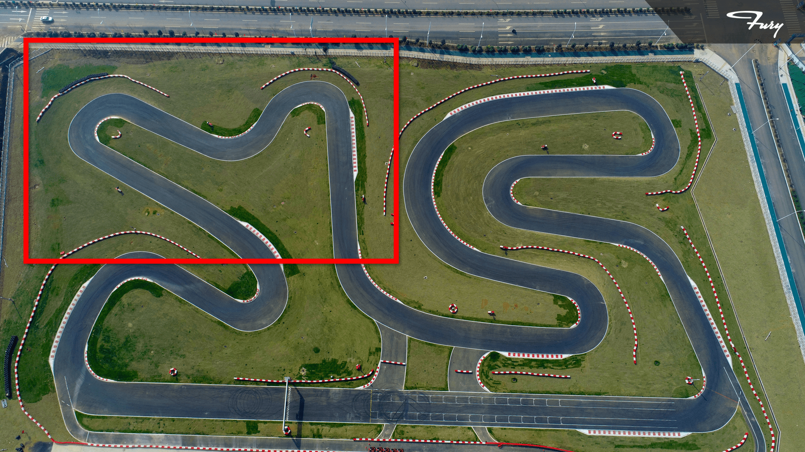

停，放大，再放大以后，我们首先画出通过这一段的**最短路线**

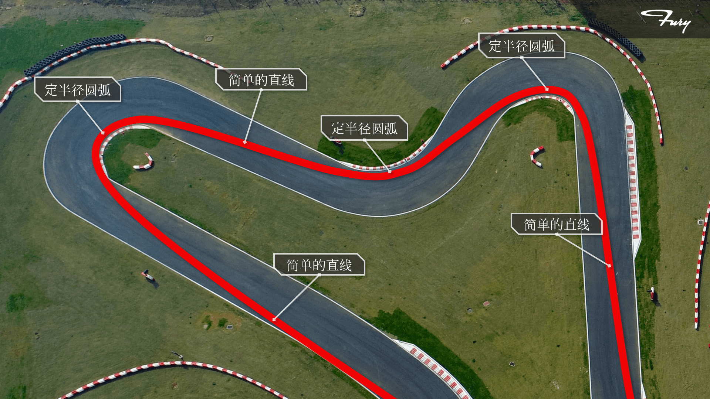

可以看到，这条路线是由**简单的直线**与**紧贴着赛道内侧的定半径圆弧**组成的（画图渣。如果赛车的速度始终不变的话，这条线就是理论上通过这段赛道的最快路线了。

HOWEVER，常识告诉我们，赛车在行驶过程中速度是不可能不发生变化的。赛车能够在直道上达到很高的速度，但是如果在弯道中依然尝试用很高的速度行驶的话，就会发生转不过弯的情况。所以实际上我们在开车转弯的时候，都会经历一个**高速直道-刹车-低速转弯-重新加速**的过程。

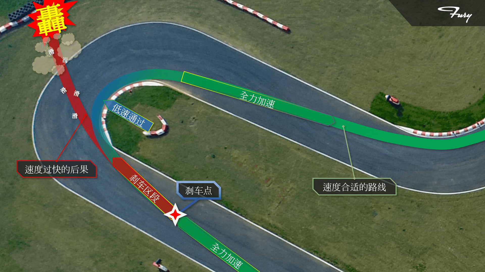

发生这种情况的根本原因应该不难理解：如果把汽车转弯理解为**平面上的匀速圆周运动**的话，赛车转弯所依靠的向心加速度全部由轮胎与地面之间的静摩擦力来实现了。
$$
F=\frac{mv^2}{r}
$$
经验告诉我们，**车轮与地面之间的摩擦力是有限的**，所以当我们尝试使用这条最短路径过弯时，过小的转弯半径使我们不得不大幅减速。为了得到更高的过弯速度以及出弯速度，我们尝试**将转弯半径尽量拉大**，于是我们得到了赛车过弯时使用的**外-内-外**过弯路线。

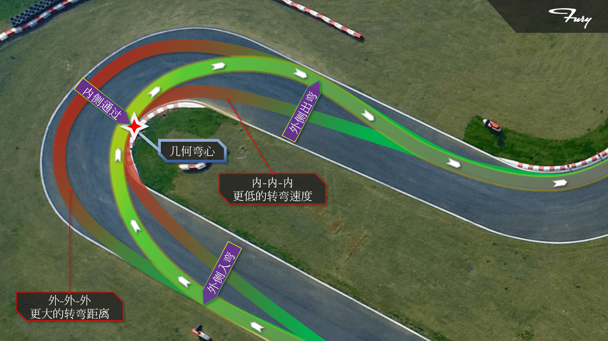

看到这里，可能会有同学产生疑惑：**为了一点速度优势多走了这么多距离，怎么就更快了呢？**

在考虑转弯线路时，加大转弯半径虽然在转弯过程中发生了时间损失，但是实际赛道是由直道段与弯道段组合而成的，**更高的出弯速度**带来直道加速段的初速度优势**会在长距离的直道中不断累积**，从而产生**总体上的时间优势**。与此同时，由于弯中速度的提高，入弯前的**刹车段也将变的更短**，刹车幅度更小。拉大半径提高速度在实际场景下还能够获取**更大的空气动力学效应**，**更低的轮胎磨损**等优势。所以总而言之，当今的赛车手都是使用这样的线路通过弯道的。

最终在整合了上述因素后，我们就得到了组合弯道目标行驶路线了。

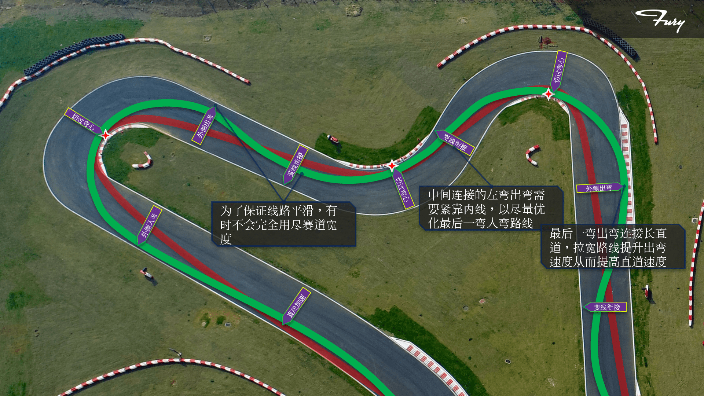

可以看到，**并不是所有弯道都会按照外-内-外的规律规划路线**。这是因为在赛道上许多弯道是**连续组合**的，我们知道我们之所以要提高弯中速度是为了**尽量提高出弯后的直道速度**，从而获得**总体的时间收益**。因此在连续弯道路线规划中并不会全部严格按照外-内-外的规律，而是将弯道路线综合考虑组合方式，最终才得出一条赛道的理想路线。

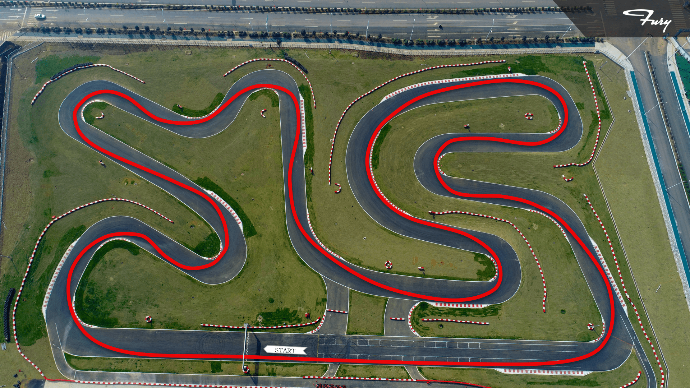

除此之外，赛车的性能，赛道的路面，天气变化等现实世界中的变化也会对路线选择产生影响。当然，这些内容不在这篇文章的讨论范畴，我就不废话了（捂。

[[中字] 关于弯角你需要知道的一切](https://www.bilibili.com/video/av37458672/)

[【弹幕中字 Chain Bear F1】搞懂赛车线！ - "红色烈火拖拉机" 中字翻译](https://www.bilibili.com/video/av23229684/)

[驾驶课程-初级课程 [赛车行驶路线]](https://www.bilibili.com/read/cv114325)

路线选择只是上赛道前要做的第一步，赛车在赛道上是怎样沿着既定的路线形式的，这就是我们接下来要讨论的话题。

### 抓地力

能够改变赛车速度和方向的力，**全部来自于地面和赛车轮胎之间的摩擦力**。具体而言，在赛车完全按照预定轨迹行驶的过程中，轮胎与地面之间的纵向“静摩擦力”改变速度；侧向“静摩擦力”改变方向。

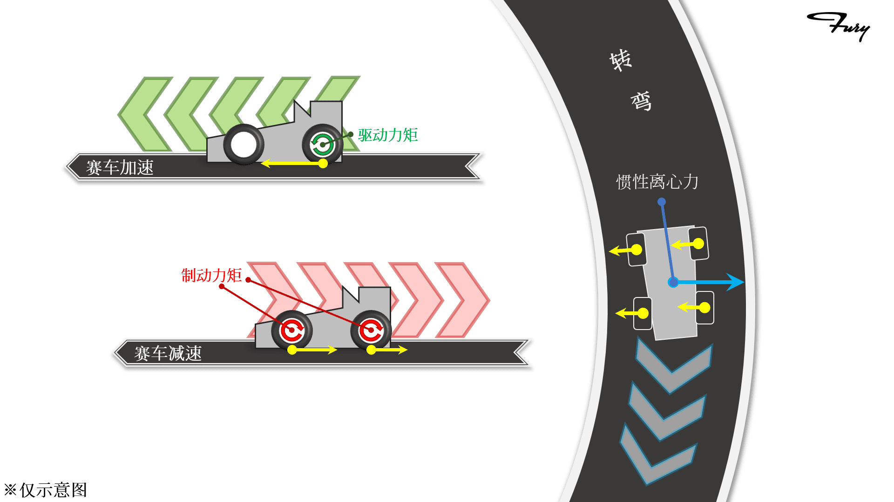

这里的“静摩擦力”并不是严格意义上的静摩擦力，而是形容赛车在按照轨迹行驶时，车轮应该是完全滚动摩擦。实际上赛车轮胎的运动非常复杂，使用“静摩擦”来类比可以比较浅显地解释一些现象。

比如有”静摩擦“就会有”滑动摩擦“。

当赛车速度过快，轮胎能够提供的最大侧向摩擦力不足以抵消循迹需要的惯性离心力时，赛车就无法循迹，产生向弯道外侧的滑移。换句话说，一台赛车的轮胎能产生多大的侧向摩擦力，**这决定了赛车能用多快的速度通过弯道**。这就是赛车的转弯时能够达到的极限速度。

同样的，当赛车加速或刹车时，赛车会对轮胎施加转矩。而轮胎通过摩擦力使赛车加速或减速。当这个转矩过大，轮胎就会出现**空转**或是**抱死**。而轮胎在纵向能够提供的最大摩擦力**决定了赛车能够有多大的加减速能力**，这就是赛车加速与刹车的极限。

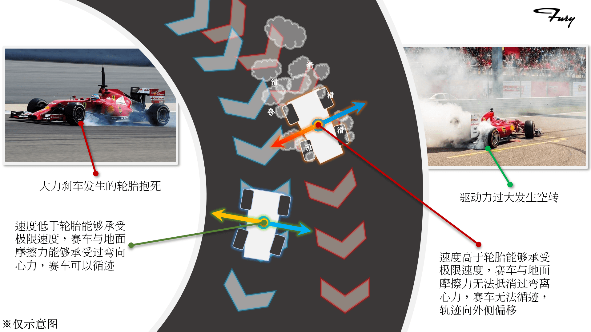

一台赛车的极限速度受到很多因素的影响，悬架调校、四轮定位、路面质量等等很多因素都会对赛车的性能产生巨大的影响。努力提升这个极限速度，就是车队的工程技术团队的核心任务。

[驾驶课程-初级课程 [抓地力]](https://www.bilibili.com/read/cv107064)

### g值圆

一般在描述赛车行驶受力的时候，我们使用更好测定的加速度表示。以重力加速度**g**为单位，赛车向任意方向受到的加速度被除以***g***表示出来，比如赛车过弯时受到**1.2**倍重力加速度的向心加速度，我们就描述为**1.2g**。这种描述方法十分常见，相信大家都不陌生。

描述赛车在地平面上的运动受力我们一般使用叫做**g值圆**的图表。这种图表类似于**极坐标**，使用同心圆来表示加速度的量，使用不同的方向角来表示方向。使用这种图表我们可以实时了解到赛车的受力情况，还可以直观地将赛车的极限表示出来。

[本田思域Type R 纽北破纪录实况](https://www.bilibili.com/video/av21309118/)

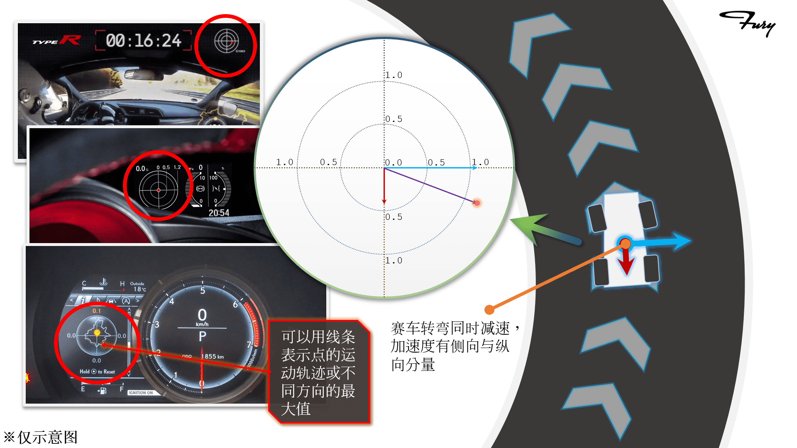

在远古时期，穷苦的赛车手用不上加速度仪表时，智慧的劳动人民就想到过一种指示加速度的替代办法——水杯。

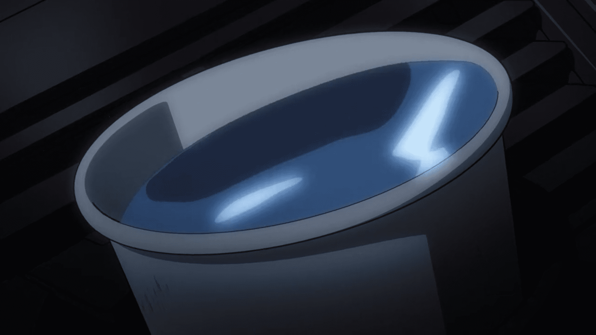

如果你明白了赛车为什么存在极限速度，想必你也就能够很自然能够明白赛车就是一项游走在极限上的运动。那么现在我们来看一些极限的情况吧。

### 转弯的极限

众所周知，赛车有前轮和后轮(废话)，如果把它们分开来看的话，**它们都会有各自的极限**。越过极限的一侧轮胎**失去循迹能力**，就会向弯道外侧滑移。

**转向不足(Understeer)**是**前轮比后轮先失去循迹能力**的情况。在这种情况下，**赛车无法随着前轮的指向移动**，而是会因为惯性指向弯道外侧。所以车手会感觉无论怎样向扭动方向盘，赛车都无法随着指向转弯。转向不足也被俗称为“**推头**”。为了改出这种情况，需要车手减速，以至于速度降低至前轮抓地力能够承受转向要求的离心力作用，而恢复循迹。

[驾驶课程-初级课程 [转向不足]](https://www.bilibili.com/read/cv160656)

**转向过度(Oversteer)**是**后轮比前轮先失去循迹能力**的情况。在这种情况下赛车的尾部会因为惯性离心力的作用甩向弯道外侧，因此也被俗称为“**甩尾**”。这种情况出现时，赛车会因为惯性自然地指向弯道内侧，甚至出现打转的情况。当这种情况出现时，车手除了需要减速，一般还需要反打方向使前轮指向正确的行驶方向。如果这种动作操作得当，车手就能控制后轮滑行的幅度，并以甩尾的姿态通过弯道，这就是所谓“**漂移**”。

[驾驶课程-中级课程 [转向过度]](https://www.bilibili.com/read/cv241318)

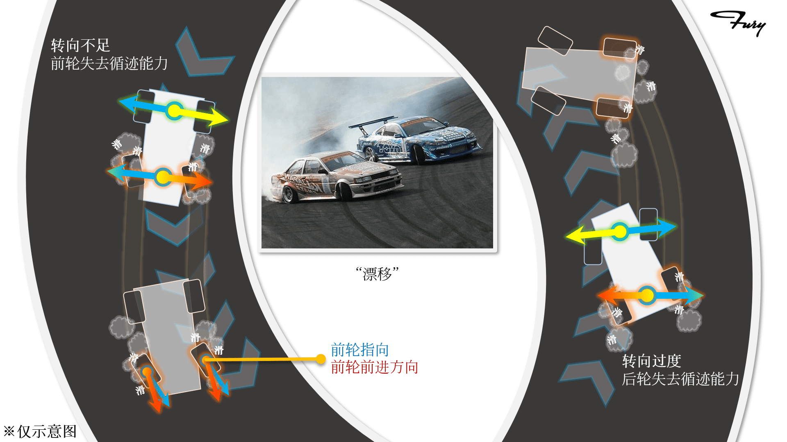

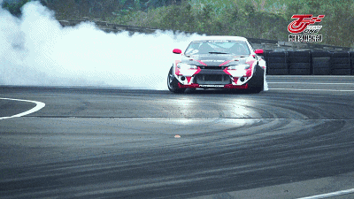

在正常的循迹驾驶过程中，这两种情况的出现就意味着赛车失去控制。但实际上因为赛车轮胎的运动特性非常复杂，这两种情况经常并不是瞬间出现的，而是随着速度的变化逐渐产生。所以大家可以看到在一般情况下车子虽然发生前轮或后轮的滑行，但是依然具有一定的循迹能力。

[【66熟肉】推头和甩尾的区别，你真的懂吗](https://www.bilibili.com/video/av10743301/)

转向过度或是转向不足除了描述上述现象，更多地是用来**形容一台赛车转弯时容易出现的运动趋势**，或被称作赛车的**弯道动态特性**。因为这种情况的出现与前后轮的极限有关，所以这种特性是**可以通过调校改变**的。一台调校得当的赛车在正常操作下，可以出现前后轮同时达到极限的情况，赛车可以很轻松地跟着方向盘的转动转弯，这样调校的赛车就被认为具有**中性转向特性(Neutral)**。一般这种调校的赛车会被认为是将抓地力潜力发挥到极限的。但是赛车特性的决定因素与许多因素有关联，现实中几乎不可能做到完美。市面上调校赛车或是调校所有汽车时，都会将汽车调校成具有轻度转向不足特性，因为转向不足现象只需要减速就可以改出，相比转向过度具有绝对的安全性优势。

### 刹车的极限

在进入弯道之前，赛车一般需要减速从而循迹通过弯道。这时，赛车的制动能力就显得非常重要了。一个迅猛的制动快速降速，能够尽量缩短刹车距离，拉长制动前的全速路段，从而获得时间优势，学过积分的同学们一定不难理解这一点。那么问题来了：**什么样的刹车动作是一次优秀的刹车呢？**

我们知道，制动的机械过程就是通过人脚踩下**制动踏板**，从而利用**杠杆与液压放大作用**将踩踏力转化为**对制动盘的夹紧力**，利用制动盘与刹车片之间的**摩擦**来给车轮施加制动力矩，最后通过轮胎与地面之间的摩擦力实现赛车的减速。

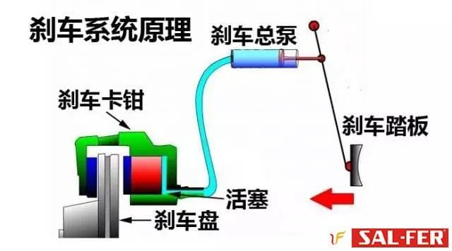

轻踩下踏板时，车轮的制动力矩不够抵消地面对车轮的静摩擦力产生的力矩，于是赛车缓缓地减速，减速度的大小就与人踩踏踏板的力正相关。

当踩下踏板的力达到了一定大小，踏板被踩到了一定深度，此时车轮的制动力矩增大，以至于能够与车轮与地面摩擦力产生的力矩相抵消，车轮就会发生抱死现象。这时制动盘与刹车片之间静摩擦，无论如何增大踩踏力度，车轮与地面之间都会保持滑动摩擦状态，赛车减速度基本稳定在了这个滑动摩擦力提供的减速度上。

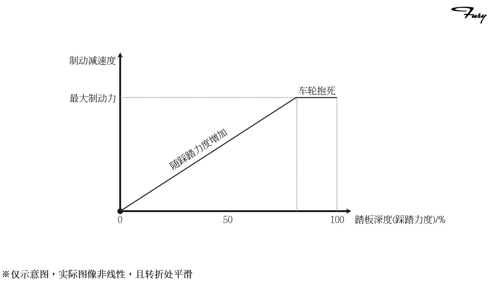

那么把车轮踩到抱死的刹车是一次优秀的刹车吗？不是。

- 滑动摩擦力并不是车轮能够提供的最大摩擦力。在实际环境中，滑动摩擦力会略小于最大静摩擦力。

- 无论前轮还是后轮先发生锁死都意味着失去循迹能力，赛车的减速轨迹会高度不可控。前轮锁死会发生严重转向不足，赛车会笔直地沿着前进方向惯性移动。后轮锁死则会有转向过度的可能，若操作不当使赛车受到侧向力，赛车则会直接在制动过程中发生甩尾打转且极难救车。

- 车轮与地面的滑动摩擦会严重磨损车胎。车胎在摩擦后还会引起轻微的车轮失圆，这个失圆产生的振动如果一不小心对上了某些共振频率还会引起更大的麻烦[(比如颠掉前翼)@歪头](https://www.bilibili.com/video/av47944756)

  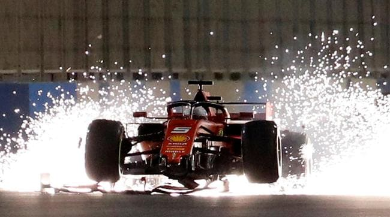

所以说车轮抱死的刹车**不仅不优秀，反而是最糟糕的一种情况**。

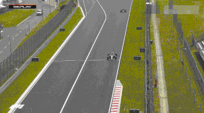

优秀的刹车同样与轮胎极限有关。一个优秀的赛车手能够将刹车控制在**车轮转与不转的边缘**，车轮与地面间已经不完全是滚动摩擦，但仍然保持旋转，因此仍然具有一定的循迹能力。这就是**临界刹车**。这种技术在没有[防抱死系统(Anti-lock Braking System)](https://baike.baidu.com/item/防抱死制动系统)的方程式赛车上有很高的操作难度，因为需要很精确的踩踏力度控制。**最优秀的刹车与最糟糕的刹车之间也许只有一张纸的距离**。但这种细致的控制技术也是赛车运动魅力的来源(之一)。

[AMG驾驶学校 第2集 [刹车基础]](https://www.bilibili.com/video/av29983278/)

[驾驶课程-初级课程 [刹车技术]](https://www.bilibili.com/read/cv152410)

[驾驶课程-初级课程 [临界刹车技术]](https://www.bilibili.com/read/cv238651)

### 循迹刹车

了解了临界刹车，我们现在来了解一种更为极限的减速操作

我们在描述赛车抓地力时发现赛车的抓地力被分为了纵向与侧向分力。实际上的轮胎受力应该是这两个分力的合力。这个合力转化为加速度，就可以被g值圆表示出来。同样的，赛车能够循迹行驶的极限加速度，也是由侧向极限与纵向极限合成的。这个合成的极限表现在g值圆上，应该是一个近圆形。

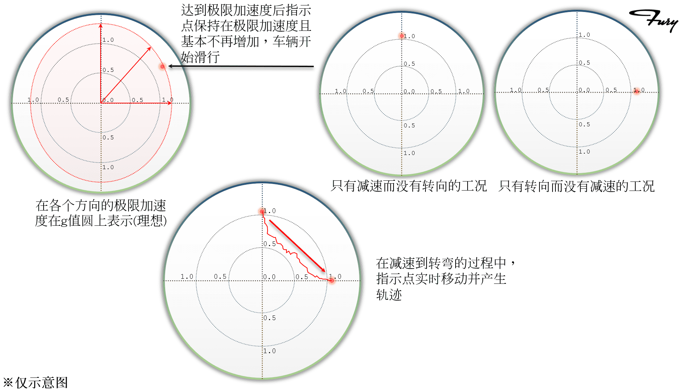

在极限的操作下，一个优秀的车手在入弯时由减速进入转向的过程中，可以一直保持赛车处于极限边缘。也就是说，在减速状态与转向状态转换过程中，一个优秀的车手是可以做到“**转弯与制动同时进行**”的操作的，这就是循迹刹车技术。

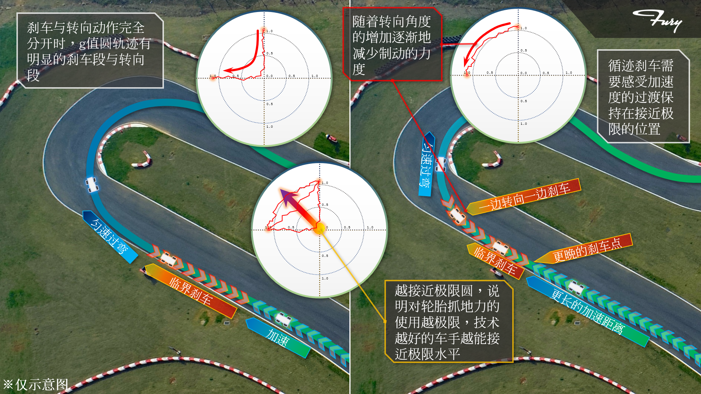

相比只在直线路段刹车，能够做到循迹刹车的车手无疑拥有更强的速度控制能力。循迹刹车技术也能够在复合弯路段中充分利用赛道长度进行减速，最大化利用赛道中的加减速距离。但是相必大家已经能够从上文的描述中看到这种刹车操作的难度。刹车技术是赛车中最重要的单项技术之一，能够在刹车与转向的复合加速度变化中准确把握赛车的极限，用身体感受动态过程中的加速度变化，勤奋的练习和天赋都非常重要。同时作为工程师，我们也必须要理解这种技术的存在。

### 加速的极限

说完转向和刹车，我们来了解最后一个控制赛车的基本操作——踩油门。

刚刚在讲刹车的时候提到：如果对轮子加上**过高的转矩**(比如制动力矩)以至于突破了轮胎与地面之间的最大静摩擦力，轮胎和地面之间就会发生滑动摩擦。所以反过来也是一样的，当驱动力矩过高的时候，车轮就会发生空转。

那么这个驱动力矩在什么时候会大到引发车轮空转呢？

我们在高中时有做过汽车启动过程中最大加速度与最大功率有关的题目，我们知道在输出功率较低的区域，或可以理解为**车速相对较低的区域开始加速**的过程中，赛车能够输出非常大的驱动力。这一点在电动车上可以很容易地感受到。如果在低速时深踩油门，就会使赛车瞬间向驱动轮输出非常大的驱动力矩。这时如果赛车动力足够强劲，这个力矩就会使驱动轮发生空转。

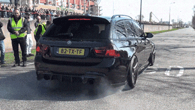

如果起步时驱动轮发生空转，赛车起步反应时间会受到很大的影响，导致落后于人。后驱车起步甚至有可能发生偏航与旋转，一不小心画出一个甜甜圈。

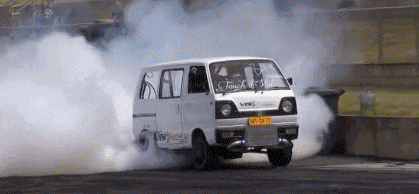

想必大家看到这里已经能够理解为什么起步与出弯阶段会成为油门控制的难点了。起步与出弯阶段都是赛车从低速状态开始向全力加速变化。如果油门踩踏过深，就会导致驱动轮极限被突破。而在两侧驱动轮进入滑动摩擦状态后，它们与地面之间的摩擦力就基本完全取决于地面摩擦系数了。万一出现左右摩擦力不均而在两侧驱动轮之间出现力矩，就有很大的可能导致赛车偏航。

所以完美的出弯加速与循迹刹车道理相同，当输入更大的油门时，转向就应该做出相应的回正，让赛车尽量保持在轮胎的极限范围上。

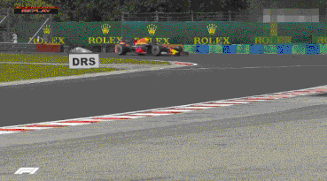

如果在弯中或是出弯时踩深了油门，还会因为驱动形式的不同产生不同的结果。

- 前驱车：前轮抓地破坏，发生转向不足。

- 后驱车：后轮抓地破坏，发生转向过度，甚至原地画圈。

- 四驱车：四轮抓地破坏，赛车向弯外侧偏离，高度失控。

[头哥卡丁车甜甜圈](https://www.bilibili.com/video/av69262668/)

现在我们说完了油门，刹车，转弯这三大开车基本操作中可能遇到的极限情况了。如果完全明白了以上的内容，你就已经基本掌握了赛车运动的基本规律了。在此基础上，我们说点有意思的，比如围场中火药味最浓的部分：

## 超车

在多车竞技的赛场上，能够实现名次上升的最直接有效的办法就是超越。如何不断超车以至于赢下比赛，我们从最简单粗暴的开始讲吧。

### 开一台跑的更快的车

- **赛车场上决定名次的最重要因素是车！**

- 不要试图怀疑上一条的正确性！车手技术再好赛车上限不高也没用！
- ~~其实上一条的后半句反过来也适用@法拉利。~~

- ~~开86的拓海是无论如何也赢不了开奔驰的叔叔的！~~

- 开86的拓海是赢不了开法拉利的舒马赫的！

- 赛车是烧钱的运动！~~氪金不一定使你变得更强！但不氪金只会被时代抛弃！~~

所以最简单的超车办法就是：

**老子直道比你快**

气不气？

### 弯道超车的规则

了解完最简单粗暴的直道超越，我们回到现实（笑。一般赛车比赛由于规则限制，不同车手的赛车之间虽然或多或少存在动力差距，但一般只有火星车与慢车之间会出现直道超越。不少赛事还有明确的功率限制。所以在现在的赛车比赛中大量的超车发生在弯道中。那么在了解大量的弯道超车之前必须了解一些弯道超车的规则。

众所周知，赛车存在碰撞体积（废话。所以如果没有规则的限制，跑在前面的车手是可以将跑在后面的车手阻拦住，或是将它们挤出赛道的。所以一般多车齐跑的赛车比赛，都会对线路做出很大的限制，以保证赛车手的安全以及赛场和谐。一般约定俗成的内容大致为：

- 赛车在直道上进行超越时，被超越车不能恶意挤撞超越车，不能在后车逼近时通过反复变线(画龙)恶意阻拦。
- 赛车在弯道争抢过程中，一般当两车侧面范围有重叠，它们就有义务在弯道中互相让出赛车线。比如：
  - 当超越车在入弯时成功插入被超越车的内侧弯道，被超越车就不可以向内线挤压迫使超越车驶离赛道；
  - 当超越车在出弯时成功进入被超越车的外侧弯道，被超越车就不可以向外线挤压迫使超越车驶离赛道
- 一般赛车所有车轮驶出赛道边缘白线视为驶出赛道。
- 如果通过不合理手段(碰撞、切弯)超越，则有义务将位置归还。

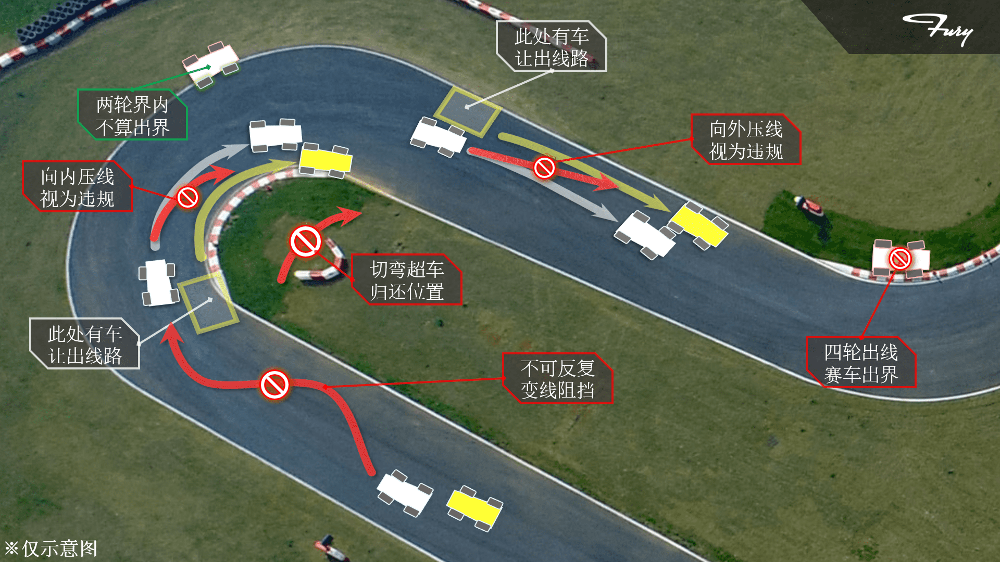

看明白这些基本规则，我们就可以开始讲一些操作方法啦。

### 进入内线

首先是相对最好理解的内线超越。内线有更短的转弯距离和更快的过弯速度，能够在入弯时进入前车内线就会有很好的超车机会。切入内线主要有以下几种方法：

- 尾流提速

  赛车在行驶过程中会受到空气阻力极大的影响。如果能够在直道或是加速路段进入前车正后方区域，就可以**利用前车破风效果**跟上前车获得直道末端的速度优势，通过突然抽头变线进入内线。

  [驾驶课程-中级课程 [尾流超车]](https://www.bilibili.com/read/cv494269)

- 延迟刹车

  延迟刹车是更普遍被使用的技术，通过**延后刹车点**并**更加剧烈地减速**使赛车获得短暂的速度优势以进入内线。但是想必大家对上面的刹车章节还有印象，延迟刹车需要良好的**车况**，熟练的**技巧**以及高度的**自信**。

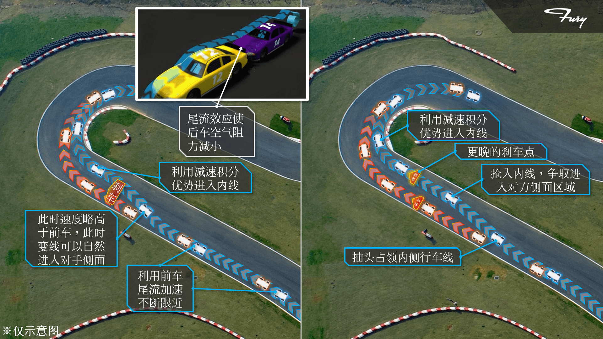

当然，进入内线的超车是一项比较容易进行防守的技术。领先的赛车也可以通过延迟刹车，甚至提前占领内线的方式进行防守。

### 外线超车

外线超车利用的是**大半径转弯带来的速度优势**。当你能够在弯中并排占据外线，更快的速度会使你在直道上超越对手。外线超车相当考虑车手对赛车侧向极限的把握以及出弯油门的控制。在顶级的赛场上利用车况以及轮胎优势的外道超车也是非常常见的，甚至领先车会让出内线位置，利用更宽的过弯路线来获得出弯后的速度优势进行反击。

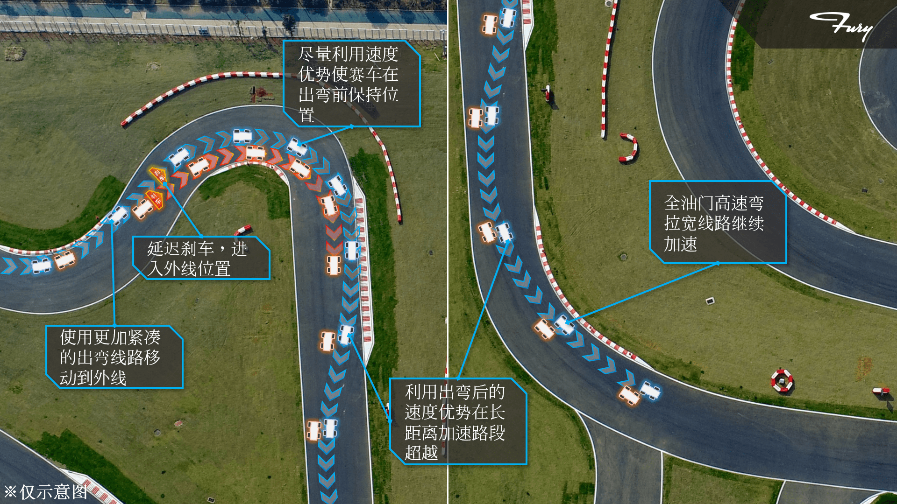

### 组合弯的博弈

在一些车况相近，车手水平相近的情况下，一次成功的超车也许会需要长期的缠斗。这个缠斗的具体内容，就是在多弯组合的赛道上复杂的线路博弈。弯道线路的取舍，延迟刹车的程度，都会成为决定胜负的一部分。

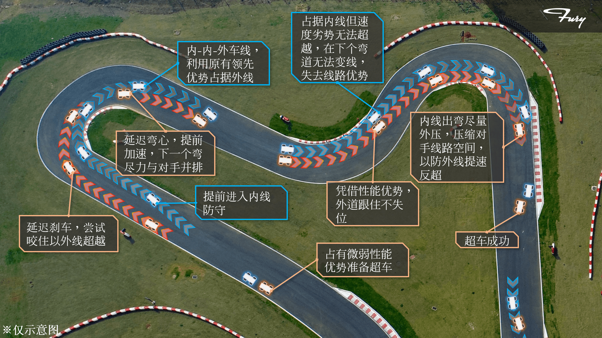

[【弹幕中字 Chain Bear F1】超车的艺术：里卡多在中国的制胜之道](https://www.bilibili.com/video/av22638592/)

[【弹幕中字 Chain Bear F1】防守的艺术：巴库超车中的成与败](https://www.bilibili.com/video/av22995095/)

[维斯塔潘咊勒克莱尔ポ及緻嘚輪對輪攻防戰 | 2019英慖大獎賽](https://www.bilibili.com/video/av59474176/)

## 说回FSAE

最后我们还是应该回到大学生方程式的部分。毕竟作为教育导向的比赛为了学生安全，将赛车简化为了桩桶赛道与计时赛的形式。3米宽的桩桶赛道省略的复杂的车线选择，禁止超车的耐久赛规则也极大限度避免了安全事故与财产损失。将比赛的重心更多地向赛车的工程设计转移。当然作为一个实打实的方程式赛车比赛级别，FSAE有它自己的参赛要领。

如果你是一个工程师，你应该充分地明白赛车的优化重点，帮助赛车提升极限：

- **增强动力**是一台赛车最本质的优化方式。动力系统（电池、电控、电机）不管放在哪个级别的赛车上，都是**成本最高**，需要投入最多精力的部分。可以说动力决定了你的赛车在围场中的排名范围，所有的设计都是从动力系统的选型开始的。
- **更轻的质量**是在整个设计过程中贯彻的。更轻的质量意味着更快的提速降速转弯，更小的机械极限负荷，也意味着更高的成本，更高的设计难度与更细致的流程控制需求。可以说，轻量化是所有赛车的工程追求，也是**一支车队技术水平与管理水平的综合体现**，尤其是在没有质量下限的FSAE围场。
- **更好的人机工程**实际上是最有效的提升手段。无论是在机械上进行专项优化，还是利用复杂的电子系统辅助。大学生方程式不存在顶级的车手与成熟的工程师。无论是利用技术辅助车手感知极限，**降低操控难度**；还是利用技术帮助工程师读取数据，**简化维护步骤**。都是变相提升赛车速度的重要方法。
- **可靠性**是体现性能的基础！在利用理论知识提升赛车理论极限时，不要忘记赛车绝非一堆模型和数据，而是实打实的工业产品，需要经历多变的实际工作环境的考验。一台不能坚持到比赛结束的赛车，甚至一台无法通过车检的赛车是没有成绩可言的。

如果你是一个车手，你应该明白能够提升驾驶能力的要素，包括但不限于：

- 更**细腻的驾驶技术**。感受刹车与油门踏板细致到蝉衣厚度的变化并控制它，感受方向盘受到地面颠簸的微小转动并控制它。细腻代表着更逼近极限与更小的失误；
- 更**强健的身体**。强健的体魄意味着能够在更大的加速度变化中保持操作的细腻与头脑的清醒，这需要极强的核心力量与心肺功能。赛车运动也是一项耐力项目，如果你的体力坚持不完体测长跑，那么你甚至恐怕会在长时间的驾驶后脱力扭不动方向盘；
- **勇气**。当你敢于将赛车推向失控的边缘，毫无疑问你会变得更快。（莽

赛车运动之所以特别，是因为它从来不仅仅是对车手个人的身体力考验，更是对团队综合实力的考验。越是高水平的赛车比赛，车手就越需要做到如机械般的细腻敏感与稳定持久。整个团队一环扣一环，每一环都同样重要。

## 最后扯皮

emm就这些内容是关于赛车的非常非常基本的知识，所以想让车队所有人都能够在脑子里对赛车这个东西有个基本的概念，以后不管是做什么方面的开发都会有自己的小目标，能够在自己心里把车子该有的样子刻画出来，能够顾及到车队整个团队做子系统之间的配合吧emm

当然关于车子的底盘机械空气动力学之类的这篇肯定是顾及不到的emm一个是这篇就想写面向全体队员的内容然后其他的细节我后面会像梁师傅一样散装往上传的emm

我自己其实19年整年做下来虽然都有顾及到但是都是学艺不精这样的一个状态，本身专业也不是机械底盘这类emm所以后面一些细节内容我会尽量写我知道的emm但是特别细致的东西应该是要交给下一届以后更有时间精力做子系统的同学研究了emm我尽力帮助大家入门然后少走弯路吧emmm
