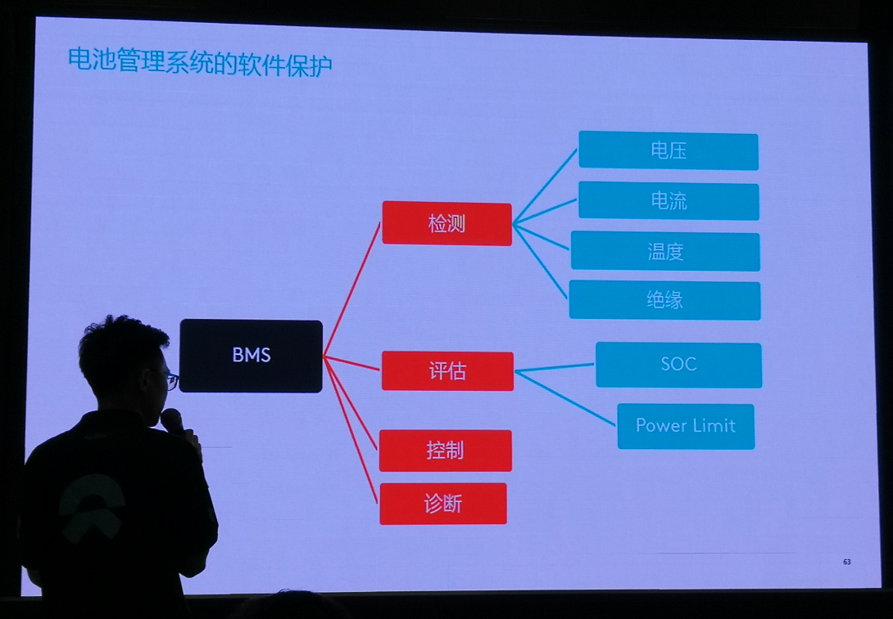

<!-- More -->

<video src="http://q4v73d4us.bkt.clouddn.com/fury教程/2020电气组寒假培训/第14讲.m4v" controls>您的浏览器不支持video标签</video>
## 电池管理系统(BMS)

- 对动力电池进行管理

## 检测功能

- ①电压采集：从控负责，将每一个电池单体的正负极都连接至从控，采集每一个电池单体的电压- 

- ②电流采集：霍尔电流传感器，信号线接入主控

- ③温度采集：热敏电阻贴到电池表面，信号线接入从控

## 评估功能 

- SOC（State of Charge）荷电状态，电池的剩余电量

## 控制功能

-  继电器的控制：将继电器的线圈黑线接到主控上，在满足上电需要时，BMS在对应的接线处给出GND信号；当BMS检测到电池发生异常，发出警告，并且断开所有继电器。

- 若BMS出现一级警报，断开所有继电器的同时，串联进安全回路的K5-也会断开安全回路，此时继电器红黑线全断。