寒假期间关于硬件电路(PCB)学习主要包括三个阶段：

阶段一：典型基本电路的了解及仿真练习：讲解内容主要涉及到仿真应用，通过仿真软件了解各基本电路的实现方式，不会涉及推导过程（本节内容只涉及到目前我们整车上面使用的一些基本电路，仿真软件可以选择Multisim或MATLAB）。

阶段二：根据大赛规则，了解学习当前整车硬件电路 （各个模块） 设计思路。学习使用AltiumDesigner软件，试着画出各模块的原理图。（可选）1、自己能根据电路原理图分析并画出逻辑流程图。2、有时间和能力的可以学习了解PCB板的绘制。

阶段三：（可选）如果大家有能力可以自己根据理解来将某一模块 (BSPD、TSAL、主板) 的电路进行仿真分析，验证自己阶段二学习过程中总结的电路逻辑。

需要提前了解三极管基础知识及Multisim的基本使用。本人能力有限若有错误的地方，希望大家能够及时指出，共同学习。

<!-- More -->

---

**阶段一**

---

### 1.电压比较器

​        大赛规则第2章12.9节中所描述的系统关键信号中的部分需要系统实时监测，且必须由硬件电子装置直接控制，不能使用软件及可编程装置控制。故选择电压比较器对关键信号进行检测。下图为电压比较器的电路图。

 

| 引脚编号 |   功能   |
| :------: | :------: |
|    8     |   VCC    |
|    3     | + 输入端 |
|    4     |   GND    |
|    2     | - 输入端 |
|    1     |  输出端  |

​        电压比较器是对输入信号进行鉴幅与比较的集成器件，它可将模拟信号转换成二值信号，即只有高电平和低电平两种状态的离散信号。图1为电压比较器电路图。常用的电压比较器应用电路有单限比较器、窗口比较器等。电压比较器可以看作是差模增益接近“无穷大”的运算放大器，只要同相 (+) 输入端与反相 (-) 输入端之间有无穷小的差值电压，输出电压就将达到正的最大值或负的最大值。

​        电压比较器的功能：比较两个电压的大小（用输出电压的高或低电平，表示两个输入电压的大小关系）：当”+”输入端电压高于”－”输入端时，电压比较器输出为高电平；当”+”输入端电压低于”－”输入端时，电压比较器输出为低电平；  **目前比较器输出多为集电极开路输出级**（后面会讲解，大家需要理解）

接下来将针对介绍两类电压比较器应用电路进行讲解

选取比较常用的电压比较器：*LM393集成模块* 

 

​                          上述图片为LM393集成模块实物图及内部电路原理图

 

#### 单限电压比较器

下图为单限电压比较器的Multisim仿真电路图

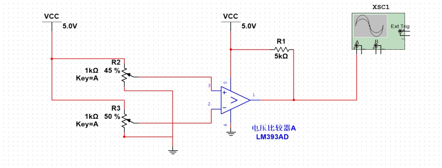                          
                                                                                     注：XSC1为示波器

​        仿真电路图中正反相输入电压都可通过滑动变阻器进行调节，当正相输入端电压大于反相输入端时，输出端输出高电平。同理小于时，输出端输出低电平。  

​        为什么输出端要加上拉电阻？上面中我们说了当前比较器的输出端多为集电极开路输出，集电极开路输出一般多与上拉电阻进行相连(上拉电阻是上述仿真图中的VCC和5KΩ电阻与输出端连接部分)。

 

​                   左图为LM393内部电路图                                                       右图为集电极开路输出  

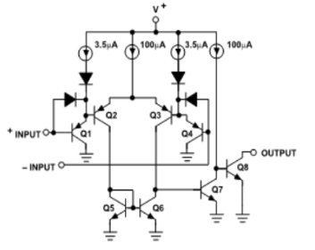  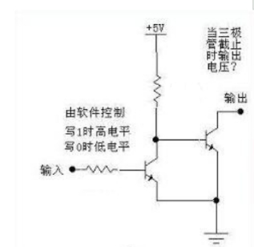

​         上述图示表明LM393的输出为集电极开路输出，该输出只有两种输出状态（输出端三极管Q8的导通或截止，影响着输出状态，而正负相输入端的电平决定着输出端三极管Q8的导通状态），当正相输入端电压大于反相输入端时，输出端三极管Q8截止，三极管Q8集电极输出为开路状态（高阻态）；当正相输入端电压小于反相输入端时，输出端三极管Q8导通，集电极输出为低电平。

​        在输出端加上上拉电阻后。当正相输入端电压大于反相输入端时，三极管Q8截止，集电极输出端为开路状态，但是上拉电阻的存在导致输出端为高电平；当正相输入端电压小于反相输入端时，三极管Q8导通，VCC与电压比较器输出端三极管Q8构成回路，集电极输出端为低电平。此时就完成一个单限电压比较器的电路。

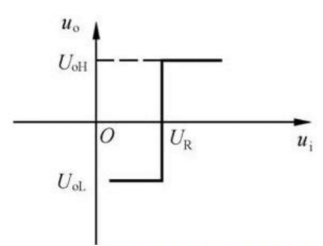

 

​        在实际整车电路中，我们需要对某个端口的电压值进行实时的监测，例如绝缘监测装置的状态输出，当输出电压Ui高于UR时，认为整车线路绝缘正常输出高电平，否则认为故障输出低电平。电路系统中采用单限比较器对该状态输出进行监测。

要求重点了解为什么LM393输出端需要上拉电阻？

后续要求大家使用仿真软件（Multisim）进行模拟仿真实验，自由发挥验证。

 

#### 双限电压比较器（窗口比较器）

​        单限比较器有一个特点，即Ui单方向变化(正向过程或负向过程)时，Uo（输出端电压）只跳变一次。只能检测一个输入信号的电平，这种比较器称为单限比较器。   

​        双限比较器又称窗口比较器。它的特点是输入信号单方向变化(例如Ui 从足够低单调升高到足够高)，可使输出电压Uo跳变两次，其电路图及传输特性如下：（牢记LM393是集电极开路输出）

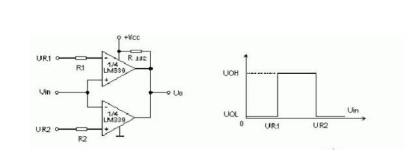 

为方便描述，上下处的电压比较器分别称为C1、C2。

​        当输入电压Uin < UR1时：C1正相输入电压小于反相输入电压，C1输出端三极管导通。C2正相输入电压大于反相输入电压，C2输出端三极管截止。由于上拉电阻存在，Uo输出为低电平。

​        当输入电压Uin > UR2时：C1正相输入电压大于反相输入电压，C1输出端三极管截止。C2正相输入电压小于反相输入电压，C2输出端三极管导通。由于上拉电阻存在，Uo输出为低电平。

​        当输入电压UR1 < Uin < UR2时：C1、C2正相输入电压大于反相输入电压，输出端三极管都截止。由于上拉电阻存在，Uo输出为高电平。 UR1为下限电压，UR2为上限电压。

 

下面根据Multisim软件的仿真过程进行讲解：

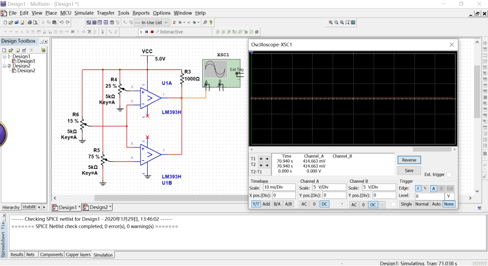 

​        上图是双限电压比较器的仿真电路（基于软件Multisim），U1A的正相输入端电压为3.75V（上限电压），U1B的反相输入端电压为1.25V（下限电压），U1A的反相输入端和U1B的正相输入端通过滑动变阻器R6进行调节（输入电压Uin），图中输入电压Uin小于1.25V，故分析输出端电压为低电平，右侧是仿真示波器的界面，显示输出端电压为411mV。（411mV是三极管导通时，集电极和发射极之间的压降）。

 

 

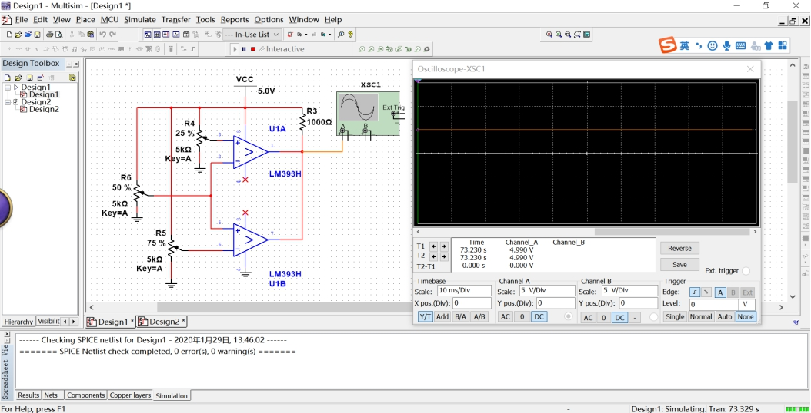 

此时调节滑动变阻器，使输入电压Uin电压值为2.5V，故分析输出端电压为高电平，右侧示波器的检测电压为4.9V。

同理大家可根据上述的仿真图，调节输出电压大于上限电压，进行分析验证。

（可选）网上了解学习关于线与的定义，进一步理解集电极开路输出（OC输出）实现线与的功能。

  

### 2.TTL集成门电路器件

​        首先了解门电路的含义：用以实现基本逻辑运算和复合逻辑运算的单元电路称为门电路。常用的门电路在逻辑功能上有与门、或门、非门、与非门、或非门、与或非门、异或门等几种（一般用到前面三个）。门电路大都是集成模块，目前使用到的有74ls04（与门）、74ls08（非门）等。我们只需要了解使用即可。

​                                        左图为74ls08集成模块                         右图为74ls08内部电路原理图

​        提到逻辑运算必然涉及到逻辑‘1’及逻辑‘0’，在逻辑电路中我们视不同分段的电压值为不同的逻辑值。在TTL门电路中也有相应的定义。电平是个电压范围，TTL电平规定如下：输出高电平 > 2.4V,输出低电平 < 0.4V。输入高电平 >= 2.0V，输入低电平 <= 0.8V，噪声容限是0.4V。

​        为了验证TTL集成电路模块，采用Multisim软件进行仿真验证。下图为软件的仿真电路。

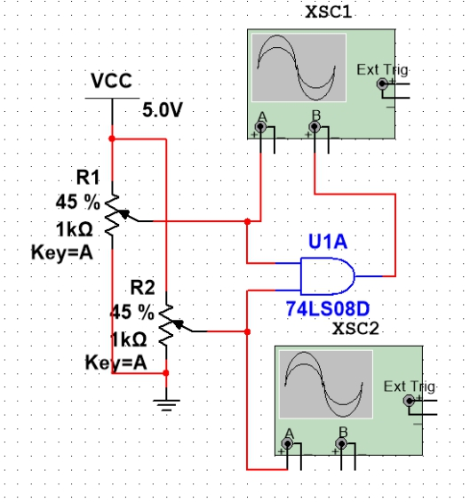

​        上述仿真电路TTL逻辑门电路两路输入电压为都为2.75V。故通过TTL电平标准，判断两路输入都为高电平，两路信号通过与门电路后输出电平为高电平（示波器B端口电压为5V）。

  

​           

​        接下来通过调节一路输入为低电平，验证门电路的输出电压。仿真电路如下：       

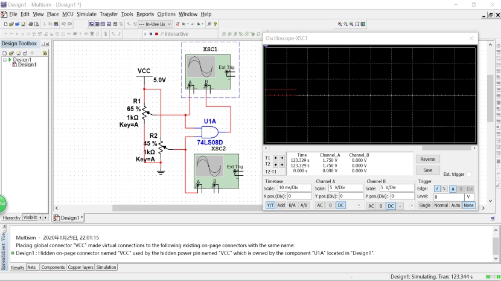

​        根据滑动变阻器的变化，得出R2输入电压没有变化，仍为高电平。R1输入电压值变为1.75V，故通过TTL电平标准，判断该路输入为低电平，故两路信号通过与门电路后输出电平为低电平（示波器B端口电压为0V）。

 

### 3.减法运算电路

​        在TSAL模块的逻辑策略中，电池箱内部继电器侧电压和箱外电机控制器侧电压需要实时监测是否相同匹配，由于上述电压位于驱动线路，其电压值较大，系统选取电压变送器将驱动线路的高压线性转换为1V ~ 5V范围内的低压。将转换为低压的两路电压通过减法运算电路来判断电压匹配状态。   

​        集成器件模块选择LM358元件（两路运算电路）   

​                                                                        下图为LM358内部原理图      

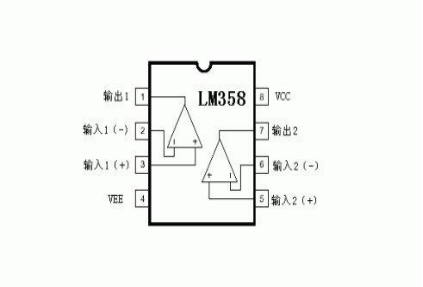

​        减法运算电路选取最常用的差分比例运算电路：

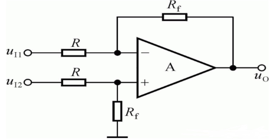

​                   

​        电路实现了对输如差模信号的比例运算， 输出电压Uo = Rf / R * (Ui2 - Ui1)

​        下图为减法器运算电路仿真图及示波器显示图：

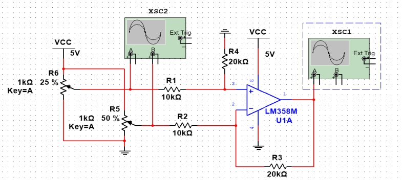

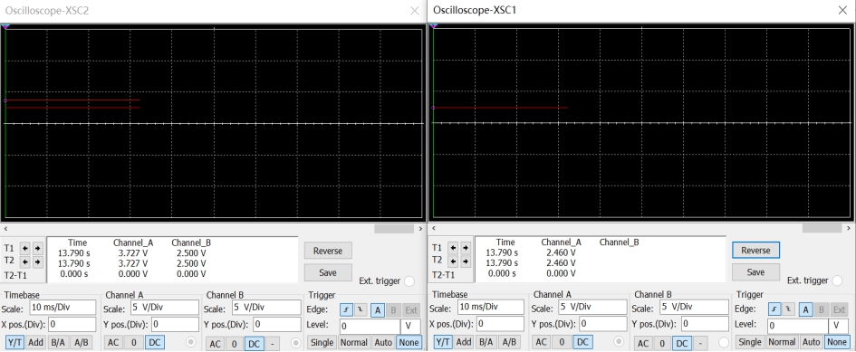

​        由示波器XSC2得出正相输入电压为3.727V，反相输入为2.500V，由推导公式得出Uo = Rf / R (Ui2 - Ui1) = 2.454V，由示波器XSC1得出输出端电压为2.46V，故成立。

​        注意：① 由于LM358的驱动电源VCC输入为5V，故输出电压最大值不会超过VCC，即使Ui2 - Ui1 > 2V后，输出电压仍会为4V。（实际情况可能会有所偏差，最好可以自己验证）② 当Ui2 - Ui1 < 0V时，输出电压一直为0V。大家可以自己设计新的减法器运算电路验证。

 

 

### 4. 继电器模块

​      主要介绍5脚继电器模块、8脚继电器模块（电磁继电器）。

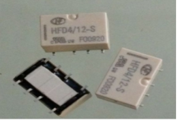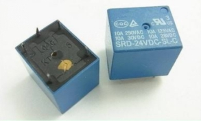

 

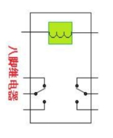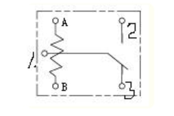

​               上图分别列出了八脚及五脚继电器的集成模块和内部电路原理图（5脚继电器原理图后续要使用）

 

 

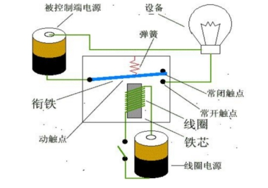

​        什么是继电器呢？这个东西很常见，在电子设备以及电力系统中的应用都很广泛，简单的来就是一种用小电流来控制大电流的开关。小电流通过线圈，产生磁场，这个磁场使得控制大电流的开关吸合。从而使得人们能够安全的超控大电流大电压设备。电磁式继电器一般由铁芯、线圈、衔铁、触点簧片等组成的。只要在线圈两端加上一定的电压，线圈中就会流过一定的电流，从而产生电磁效应，衔铁就会在电磁力吸引的作用下克服返回弹簧的拉力吸向铁芯，从而带动衔铁的动触点与静触点（常开触点）吸合。当线圈断电后，电磁的吸力也随之消失，衔铁就会在弹簧的反作用力返回原来的位置，使动触点与原来的静触点（常闭触点）吸合。这样吸合、释放，从而达到了在电路中的导通、切断的目的。对于继电器的“常开、常闭”触点，可以这样来区分：继电器线圈未通电时处于断开状态的静触点，称为“常开触点”；处于接通状态的静触点称为“常闭触点”。

​        继电器模块的内部结构一定要熟记于心，接下来根据上面集成模块的原理图来分析5脚继电器模块。继电器由**线圈工作的控制电路**和**触点接通电路**两个部分组成。在线圈两端（图中为A、B两端）加上电压或通人电流，产生电磁力，当电磁力大于弹簧反力时，吸动衔铁使常开常闭接点（3端口为常闭，2端口为常开）动作，常开触点与公共端（1端口）闭合，常闭触点（2端口）与公共端断开；当线圈的电压或电流下降或消失时衔铁释放，触点恢复原状态。 8脚继电器模块类似，多出了一组触点接通电路。下面针对继电器仿真电路进行分析。由于继电器线圈的驱动电流需要20mA - 50mA，线圈电阻100-200欧姆，因此需要添加驱动电路，仿真电路选择三极管驱动。 

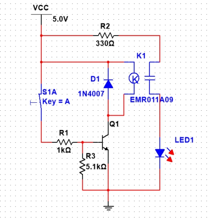

​       

​        在Multisim软件中，继电器模块就是K1（EMR011A09），其中左侧是线圈，右侧是触点。解释各个元件的作用：D1 1N4007是整流二极管，当三极管截止后，D1可为线圈产生的反向电动势提供回路，防止其他元件的损坏（当三极管导通，线圈工作时可将D1视为断路，不予考虑）。R1、R2都是限流的作用，防止三极管及发光二极管电流过大而损毁。R3的作用为了使三极管截止状态更加可靠。整个电路的思路如下：按钮Key的通断决定着三极管Q1处于导通还是截止状态，当Key按下时，三极管基极与发射极压降增加，三极管Q1导通。继电器线圈线路导通，产生电磁力，使得常开触点与公共触点闭合，线路中的LED1进入工作。当按钮回位时，三极管基极与发射极压降为0，三极管Q1截止，LED1。继电器线圈在三极管关断的瞬间产生反向电动势，通过D1释放电能。

​        Multisim中继电器模块和实际使用的模块并不完全一致，但原理相同。大家有兴趣的话可以对该电路可以改进，通过添加发光二极管实时显示线圈导通与否，注意发光二极管的正向导通压降为1.7V左右，正常工作电流大于10mA，需要添加限流电阻配合工作。

 

### 5. 延时电路

#### RC延时电路

​        系统对部分关键信号需要进行延时处理，最简单常见的应用电路就是RC延时电路。由于在电容两端加上电压时，电容会不断充电至所加的电压值，利用电容的充电时间来进行信号延迟。

​       系统在BSPD模块中使用的RC延时电路，来确定信号的可靠性。当相关信号输入时，RC电路中电容开始充电，信号持续一定时间后，电容侧两端电压电压将会增加至输入信号电压值，确定信号可靠。若信号中间中断，则会导致电容放电，电容两端电压下降，判定为非可靠信号。

​      下面对仿真电路图进行分析：

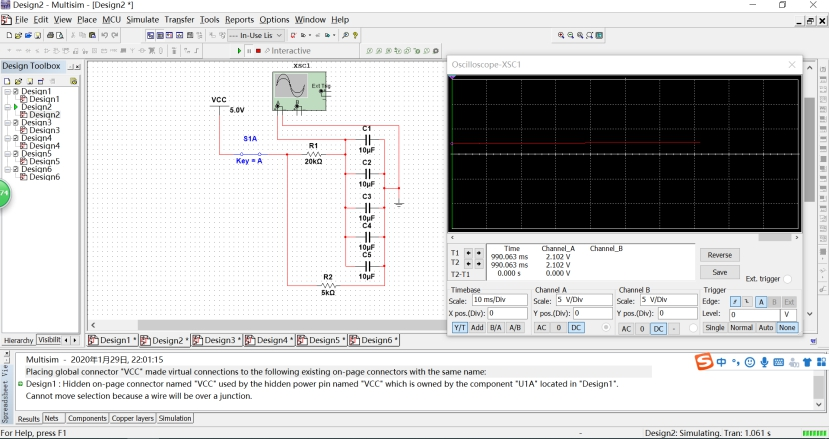 

 

​       R1与多个并联电容构成RC延迟电路，R2的作用是为了当按钮Key断开时为电容提供放电回路。当按钮按下时，VCC输入进来，此时可以视为整车某一关键信号的输入，对电容进行充电，示波器是示数可以看出，当接近1S时，电容两端的电压为2.1V（达到TTL输入高电平，TTL门电路认为信号产生了），此时就完成1S的延迟功能。

 

#### NE555定时器

​        在规则中熄火电路必须保持断开状态直到对低压系统主开关重新上电，或者 BPSD 可以在上述断开条件消失且持续 10s 以上时自行复位。10s的延迟时间，可采用555定时器实现。只需要了解标准电路应用即可。

​       下面根据仿真图来验证：

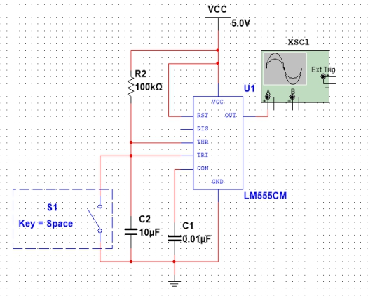

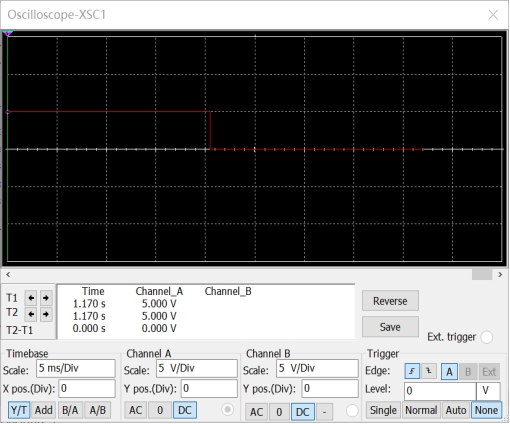 

​        上图采用了NE555定时器的单稳类应用电路，RST脚功能是直接清零端。当此端接低电平，则时基电路不工作，此时不论TR、TH处于何电平，时基电路输出为“0”，正常工作时应接高电平。DIS脚放电端，延时电路不用。THR、TRI分别为低触发端、高触发端。CON一般连接0.01uf电容与地相连。         该电路的特点是当Key未按下时，Uout = 0V处于稳态；当Key按下时，Uout电压值会瞬间达到VCC，处于暂稳态。只有当Key恢复后，且持续T = 1.1 * R2 * C2 时间，Uout = 0V会再次进入稳态。通过调节电阻和电容的型号，满足当BSPD断开信号消失10S后才进行复位的要求。